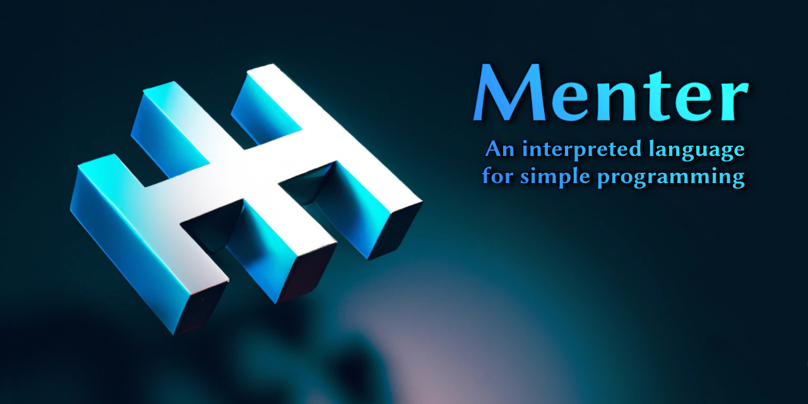

# Menter

An interpreted language for evaluating expressions with functions and variables originally written for the
[LaunchAnything Bar](https://github.com/YanWittmann/launch-anything). This is the third iteration of the evaluator.

## Specification

Check out the [loose specification](doc/requirements.md) for the language.

